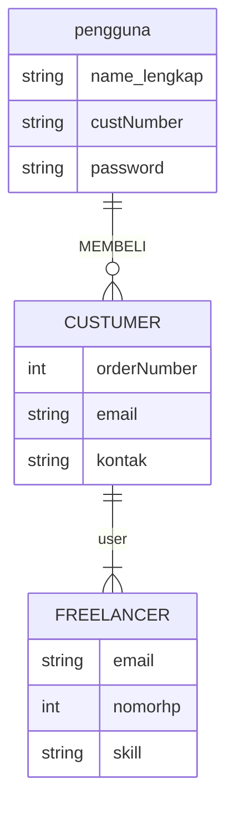
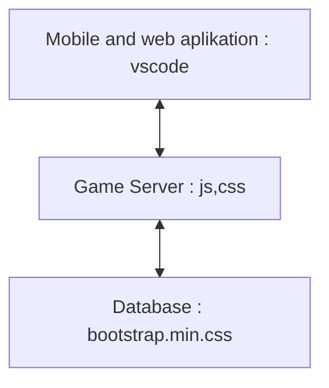

## 1.1 Latar Belakang

Freelance adalah istilah freelance online, sebenarnya ini adalah pekerjaan yang dilakukan secara sambilan atau lepas tanpa terikat dengan perusahaan mana pun.

4 Alasan Kenapa Freelancer Jadi Pekerjaan yang Diburu
Saat ini banyak sekali jenis pekerjaan yang bisa dilakukan, salah satunya dengan menjadi freelancer. Pekerja lepas yang tidak terikat dengan aturan waktu dan tempat tertentu seperti ini sedang banyak diminati akhir-akhir ini . Karena dianggap sangat mudah dan juga tidak terikat dengan suatu perusahaan membuat banyak orang jadi tergiur untuk menekuninya.
Masih ada alasan lain mengapa seseorang lebih memilih jadi freelancer daripada bekerja langsung ke kantor atau tempat tertentu, beberapa di antaranya benefit yang freelancer dapati sebagai berikut.
1. Penghasilan Sesuai dengan Pekerjaan
2. Waktu Kerjanya Fleksibel
3. Bisa Dikerjakan di Mana pun
4. Tak Harus Bertemu dengan Banyak Orang
   
adapun Keuntungan pekerjaan freelance meliputi fleksibilitas yang tinggi dalam memilih proyek, jadwal kerja, dan lokasi kerja. Freelancer dapat bekerja dari rumah, kafe, atau di mana saja yang mereka pilih. Mereka memiliki kontrol penuh atas karier mereka dan dapat menentukan sendiri berapa banyak proyek yang mereka ambil.

Disini saya membuat sebuah aplikasi berbasis web yang dmn di dalam nya CV dan skil pribadi saya sepeti Designer, Web Developer, Vidiographer, Photographer, Pendaki untuk menawarkan jasa sesuai keahlian saya.
Karena banyaknya orang yang mempunyai sebuah keahlian yang tidak bisa di kembangkan utnuk menjadi sebuah pekerjaan dan mendapatkan penghasilan. Maka dari itu saya membuat sebuah aplikasi untuk memudahkan mengakses job freelance.

## 1.2. Deksripsi Teknologi Informasi
aplikasi berbasis web ini dimana si pengguna dapat masuk ke aplikasi tersebut dan bisa melihat jasa-jasa si freelancer upload cv dan fortopolio di aplikasi tersebut, lalu pegguna bisa mencari jasa sesuai yang dia butuhkan di menu pencarian dan akan di arahkan ke freelancer yang menawarkan jasa nya sesuai si pengguna cari.
setelah itu ketika pengguna mengeklik jasa freelancer yang dia pilih akan melihat kan cvjobfortopolionya si freelancer dan hasil hasil skill dia upload agar si pengguna tertarik.
lalu cutomer sudah tertarik atas hasil karyanya customer bisa langsung menghubungi freelancer tersebut sesui kontak yang sudah tercantum 

maka dari itu saya membuat aplikasi berbasis web untuk menawarkan jasa pibadi saya sesuai skill yang tercantum di CV, yang dimana aplikasi itu dapat memudahkan dalam hal pekerjaan sesseorang dengan menggunakan sebuah aplikasi tersebut, aplikasi itu juga ada fithur dimana orang orang bisa melihat skill dan kemamupuan kita sebagai seorang freelancer agar si customer bisa tertarik dari hasil skil dan portofolio yang kita upload sebagai freelancer adapun ketika costumer minat hasil dari karya si freelancer, costumer bisa menghubungi kontak yang sudah tercantum di aplikasi berbasis web tersebut.
aplikasi tersebut dapat digunakan oleh si pengguna untuk melihat sebuah uploaddan si freelancer seperti aplisi shopee atau marketplace 

## 1.3. Branding

Pada tahap ini kita mengeksplorasi branding dari sistem yang dibuat. Branding meliputi:

- Merk: CVJOB
- Tagline:job freelance mudah dan menyenangkan karena sesuai hobi masing masing
- Campaign: bagaimana membuat aplikasi ini untuk memudahkan orang lain menyalurkan hobi,skill nya agar bermanfaat untuk orang lain yang membutuhkan dan dapat bertanggung jawab atas pekerjaanya
- Target user:
   - usia 17+
   - Seorang yang senang freelance job agar tidak jenuh
   - Seorang yang senang mengeksplorasi inspirasi dan informasi baru
   - Seorang yang ingin atau sudah memiliki sikap bertanggung jawab
   - Seorang yang ingin hobi atau skillnya dapat bermanfaat bagi orang lain dan berbuah hasil
- User experience theme:
   - Mudah
   - Sederhana
   - simple
- Warna: ala ala skai blue 
Inspirasi desain:
! [gamabr] (

## 2. User Story

Sebagai | Saya ingin bisa| Sehingga | prioritas 
---|---|---|---
freelancer | menawarkan dengan cara mengupload jasa pribadi| custumer dapat melihat hasil dari jasa nya  | ⭐⭐⭐⭐⭐
freelancer | Melihat CV saya dan melihat skill saya | orang lain dapat percaya atas jasa kita | ⭐⭐⭐⭐⭐
customer | mengirim pesan untuk memesan jasanya | memudahkan memesan job dengan mudah dan tidak sulit | ⭐⭐⭐⭐⭐
customer | Membalas pesan customer ketika sedang memesan | customer dapat saling konfirmasi | ⭐⭐⭐⭐⭐
customer | melihat hasil karya dari si orang tersebut sebagai freelancer | cutomer ada ketertarikan dan kepercayaan untuk kita pesann atas jasaanya | ⭐⭐⭐⭐⭐
freelancer | memosting hasil karyanya | custumer bisa melihat hasiltersebut | ⭐⭐⭐⭐⭐ 
pengguna | bisa melihat lihat sebuah freelancer yang menguplload sebuah jasanya | bisa mengeklik uplodan freelancer tersebut dan dapat bisa lebih detail lagi melihat tentang jasa si freelancer |  ⭐⭐⭐⭐⭐ 
pengguna | bisa mencari jasa sesuai yang pengguna butuhkan | pengguna tidak cape cape mencari kemana mana | ⭐⭐⭐⭐
## 3. Struktur Data
Cara membuat aneka macam bentuk grafik menggunakan mermaid.js bisa lihat di [https://mermaid.js.org/syntax/entityRelationshipDiagram.html](https://mermaid.js.org/syntax/entityRelationshipDiagram.html) 
erDiagram
  

  

## 4. Arsitektur Sistem

Masih pake mermaid.js juga bisa lihat flowchart di [https://mermaid.js.org/syntax/flowchart.html](https://mermaid.js.org/syntax/flowchart.html)

## 5. Teknologi, Library, dan Framework

$(document).ready(function() {
  AOS.init( {
    // uncomment below for on-scroll animations to played only once
    // once: true  
  }); // initialize animate on scroll library
});

// Smooth scroll for links with hashes
$('a.smooth-scroll')
.click(function(event) {
  // On-page links
  if (
    location.pathname.replace(/^\//, '') == this.pathname.replace(/^\//, '') 
    && 
    location.hostname == this.hostname
  ) {
    // Figure out element to scroll to
    var target = $(this.hash);
    target = target.length ? target : $('[name=' + this.hash.slice(1) + ']');
    // Does a scroll target exist?
    if (target.length) {
      // Only prevent default if animation is actually gonna happen
      event.preventDefault();
      $('html, body').animate({
        scrollTop: target.offset().top
      }, 1000, function() {
        // Callback after animation
        // Must change focus!
        var $target = $(target);
        $target.focus();
        if ($target.is(":focus")) { // Checking if the target was focused
          return false;
        } else {
          $target.attr('tabindex','-1'); // Adding tabindex for elements not focusable
          $target.focus(); // Set focus again
        };
      });
    }
  }
});
saya membuat aplikasi ini dengan vscode
database bootstrap.min.css

- Bahwasanya bnyak nya fitur yang sangat mudah dan sinmple untuk di pakai di aplikasi ini
- dan juga bisa di kembang kan aplikasi tersebut dalam bentuk apapun
- 

## 6. Desain User Experience dan User Interface

![poto] (
![poto] (
![poto] (

## 7. Demonstrasi Video

Link youtube nya

## 8. Bagaimana mesin komputasi dan sistem operasi berperan dalam produk teknologi informasimu ?

Link youtube nya di detik jawaban ini

## 9. Bagaimana algoritma, struktur data, dan bahasa pemrograman berperan dalam produk teknologi informasimu ?

Link youtube nya di detik jawaban ini

## 10. Bagaimana metode pengembangan perangkat lunak / Software Development Life Cycle berperan dalam produk teknologi informasimu ?

Link youtube nya di detik jawaban ini

## 11. Bagaimana database / sistem basis data berperan dalam produk teknologi informasimu ?

