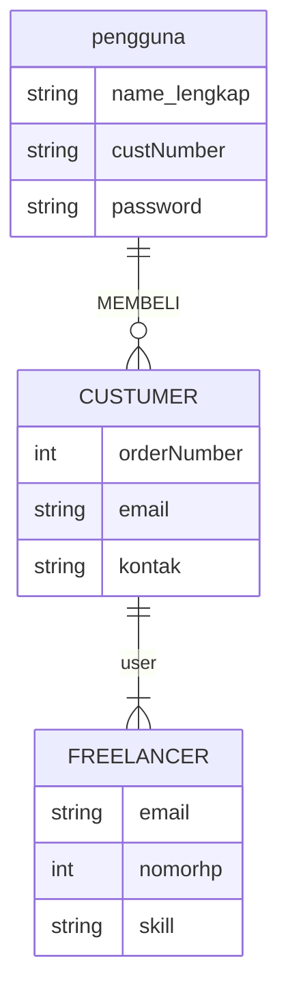
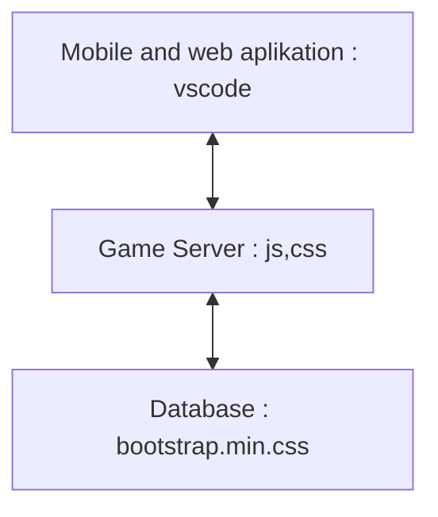

## 1.1 Latar Belakang

Saat ini RABBANI diperuntukkan khusus untuk tenaga marketing Travel Umroh RABBANI sebagai sarana pendukung dalam aktivitas harian memasarkan paket umroh.

RABBANI dapat meningkatkan produktivitas seorang agen pemasar sehingga angka closing jamaah meningkat dengan sangat significant

Mudah dalam pengoperasian
Cepat dalam penyajian jadwal
Akurat dalam perhitungan paket umroh

Semua dilakukan hanya dalam hitungan detik

Sebuah perpaduan antara mobile digital dengan layanan ke baitullah

Apa Kelebihannya?
- Menghitung paket umroh hanya dalam hitungan DETIK dan AKURAT
- Tenaga Marketing dapat memantau Potensi KOMISInya masing masing
- Memantau CALON Jamaah & JAMAAH dimana saja dan kapan saja cukup menggunakan handphone android
- Memantau data jamaah para agen dibawahnya
- Terdapat Fasilitas PINTAR untuk Reminder / Pengingat, mulai dari Follow up, Keberangkatan, hingga Kepulangan
- Fasilitas share / bagi yg sangat mudah mulai dari document Ittinerary, Jadwal, Hotel, dll
- Data Terhubung langsung dengan SERVER RABBANI sehingga menjamin VALIDITAS DATA
- dan masih banyak lagi …

## 1.2. Deksripsi Teknologi Informasi
1. Informasi dan Panduan RABBANI Mobile Apps menyediakan informasi lengkap tentang rute perjalanan, hotel, transportasi, dan lokasi penting di Mekah dan Madinah. Aplikasi ini juga dilengkapi dengan panduan praktis tentang ritual umroh, termasuk tata cara thawaf, sa’i, dan hal-hal lain yang perlu diperhatikan selama perjalanan.
2. Jadwal dan Pengingat RABBANI Mobile Apps membantu jamaah umroh mengatur jadwal ibadah dengan mudah. Aplikasi ini memberikan pengingat waktu-waktu penting seperti waktu salat, waktu thawaf, dan waktu kegiatan lainnya yang terkait dengan perjalanan umroh.
3. Peta Interaktif Aplikasi ini menyediakan peta interaktif yang memungkinkan jamaah umroh untuk menjelajahi Mekah dan Madinah dengan mudah. Peta ini dilengkapi dengan penunjuk arah yang jelas dan informasi tentang tempat-tempat penting seperti masjid, hotel, restoran, dan fasilitas umum lainnya.
4. Koneksi Komunitas RABBANI Mobile Apps juga menyediakan fitur yang memungkinkan jamaah umroh terhubung dengan sesama jamaah lainnya. Fitur ini memungkinkan mereka untuk berbagi pengalaman, tips, dan saran yang berguna selama perjalanan. Hal ini dapat memperkuat rasa persaudaraan di antara jamaah umroh dan menciptakan komunitas yang saling mendukung.

## 1.3. Branding

Pada tahap ini kita mengeksplorasi branding dari sistem yang dibuat. Branding meliputi:

- Merk: CVJOB
- Tagline:Mudah dalam pengoperasian
- Campaign: RABBANI dapat meningkatkan produktivitas seorang agen pemasar sehingga angka closing jamaah meningkat dengan sangat significant
- Target user:
   - all usia
   - Seorang yang ingin mudah dalam pendaftaran ummarah
   - Seorang yang senang mengeksplorasi inspirasi dan informasi baru
   - Seorang yang ingin atau sudah memiliki sikap bertanggung jawab
   - Seorang yang ingin tau tatacara proses pemberangkatan jamaah ummrah
- User experience theme:
   - Mudah
   - Sederhana
   - simple
- Warna: ala ala skai blue 
Inspirasi desain:
! [gamabr] 

## 2. User Story

Sebagai | Saya ingin bisa| Sehingga | prioritas 
---|---|---|---
customer | Mengirim pesan kepada owner | memudahkan untuk komunikasi apabila ad kendala | ⭐⭐⭐⭐⭐
customer | bisa memesan paket ummrah sesuai jadwal yang sudah di tentukan|memudahkan customer dalam pendaftaran | ⭐⭐⭐⭐⭐
customer | bisa melihat notifikasi pemberangkatan  | cutomer bisa mempersiapkan untuk pemberangkatan | ⭐⭐⭐⭐⭐
customer | bisa sekaligus memesan hotel apabila berangkat ummrah |Memudahkan customer dalam hal penginapan | ⭐⭐⭐⭐⭐
customer | bisa memilih hotel bintang sesuai yang di inginkan |Susuai harapan customer | ⭐⭐⭐⭐⭐
owner | memberikan informasi dalam notifikasi kepada customer | customer bisa tau informasi selanjutnya |  ⭐⭐⭐⭐⭐ 
owner | Menampilkan total jamaah ummrah | Pengguna dapat bisa tau jamaah yang berangkat bersamanya | ⭐⭐⭐⭐
owner |bisa mendokumetasikan jamaah ummrah  | jamaah dapat kenang kenangan | ⭐⭐⭐⭐
## 3. Struktur Data
Cara membuat aneka macam bentuk grafik menggunakan mermaid.js bisa lihat di [https://mermaid.js.org/syntax/entityRelationshipDiagram.html](https://mermaid.js.org/syntax/entityRelationshipDiagram.html) 
erDiagram
  

  

## 4. Arsitektur Sistem

Masih pake mermaid.js juga bisa lihat flowchart di [https://mermaid.js.org/syntax/flowchart.html](https://mermaid.js.org/syntax/flowchart.html)

## 5. Teknologi, Library, dan Framework

## 6. Desain User Experience dan User Interface

![poto] (
![poto] (
![poto] (

## 7. Demonstrasi Video

Link youtube nya

## 8. Bagaimana mesin komputasi dan sistem operasi berperan dalam produk teknologi informasimu ?

Link youtube nya di detik jawaban ini

## 9. Bagaimana algoritma, struktur data, dan bahasa pemrograman berperan dalam produk teknologi informasimu ?

Link youtube nya di detik jawaban ini

## 10. Bagaimana metode pengembangan perangkat lunak / Software Development Life Cycle berperan dalam produk teknologi informasimu ?

Link youtube nya di detik jawaban ini

## 11. Bagaimana database / sistem basis data berperan dalam produk teknologi informasimu ?

